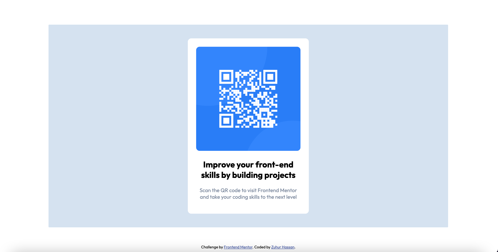

# Frontend Mentor - QR code component solution

This is a solution to the [QR code component challenge on Frontend Mentor](https://www.frontendmentor.io/challenges/qr-code-component-iux_sIO_H). Frontend Mentor challenges help you improve your coding skills by building realistic projects. 

## Table of contents

- [Overview](#overview)
  - [Screenshot](#screenshot)
  - [Links](#links)
- [My process](#my-process)
  - [Built with](#built-with)
  - [What I learned](#what-i-learned)
  - [Useful resources](#useful-resources)

## Overview

### Screenshot

### Links

- Solution URL: (https://zuhur.github.io/)
- Live Site URL: (https://zuhur.github.io/qr-code-component/)

## My process

### Built with

- Semantic HTML5 markup
- CSS custom properties

### What I learned

I learnt centering an element without the use of flexbox using the position and translate properties.

### Useful resources

- [Example resource 1](https://www.youtube.com/watch?v=rzD-cPhq02E&t=13s&ab_channel=WebDevSimplified) - This helped me fully grasp the transform translate property.
